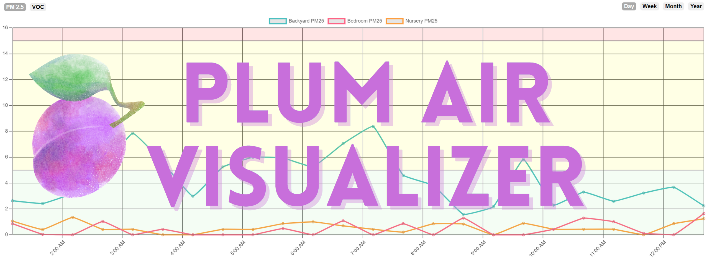
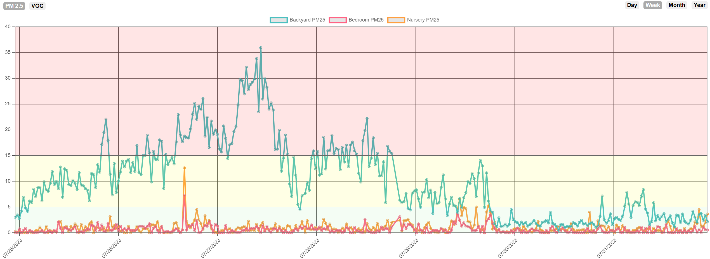
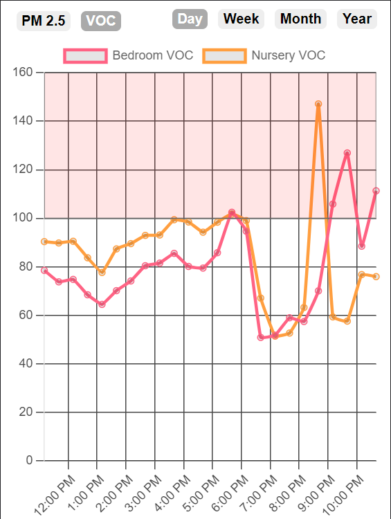

# What is this?

This is the UI portion of a two-part application. The first part being, the **Plum Air Analytics** app. 

It was built to graphically observe our residential air quality metrics over different time periods. It is resonsive on mobile devices, and the user is able to toggle between PM 2.5 readings, and VOC readings, over four different time ranges. Day (12 hours), Week, Month, and Year. The data is polled every 30 minutes.

# Requirements

This app relies on a connection to a MySQL database, where your air quality data is being written to. More specifically, it relies on the **Plum Air Analytics** app, which queries my Purple Air sensors, and writes the data to the DB. Theoretically, you could reverse engineer it to fetch the data from a datasource of your choosing.

# How do I run it?

As this is a Spring Boot application, the entry point of the application can be found at: `PlumairvisualizerApplication.java`

The `application.properties` file is parameterized, so you will have to provide the following environment variables in the run configuration of your IDE:

`APP_IPPORT=localhost:8081`

`BASE_URL=http://localhost:8081;`

`DB_HOST=[###.###.###.###];`

`DB_NAME=[name of datbase];`

`DB_PASSWORD=[*********];`

`DB_PORT=[Usually 3306 for MySQL];`

`DB_USERNAME=[*********];`

`JAVA_VERSION=17.0.2;`

`LANG=C.UTF-8;`

`SERVER_PORT=8081`

I suggest running on  8081, as **Plum Air Analytics** would presumably be running on 8080

# Application Screenshots

Dekstop Week View / PM 2.5

Mobile Day View / VOC

# Hotkeys

P - PM 2.5 View
V - VOC view
D - Day view
W - Week view
M - Month view
Y - Year view

# Future Considerations

As your dataset grows larger over time, here are a few considerations to keep in mind:

Performance: As more data points are added, it may take longer to fetch the data and render the chart. This can lead to slower load times for your page and could make interacting with the chart less responsive. To handle this, you might need to consider ways to reduce the amount of data being fetched and displayed at one time. For example, you might only fetch data for the currently selected time range, rather than fetching all data at once.

Data Aggregation: At some point, it might not be practical to display every single data point on the chart. This can make the chart hard to read and could hurt performance. Instead, you might want to aggregate the data into larger time intervals. For example, instead of displaying data for every 30 minutes, you could display hourly or daily averages. This can help maintain performance and readability as your dataset grows.

Storage and Retrieval: Depending on the database or backend service you are using to store your data, you might need to consider how best to structure and index your data to support efficient retrieval. This could involve creating indexes on the timestamp field, or partitioning your data by time.

Data Retention Policy: Depending on the size of your data and your storage capacity, you might need to define a data retention policy that specifies how long you keep detailed data. For example, you might decide to only keep detailed data for the past month and use aggregated data for older time periods.

Error Handling: As your data grows, there's a higher likelihood of encountering errors or inconsistencies in your data. You should consider implementing error handling mechanisms to manage such situations.

Data Backup and Recovery: Ensure that your data is regularly backed up and you have a recovery plan in place. This will prevent any loss of data due to unforeseen circumstances.

Remember, as your data grows, it's a good idea to periodically revisit these considerations and adjust your strategy as necessary.
